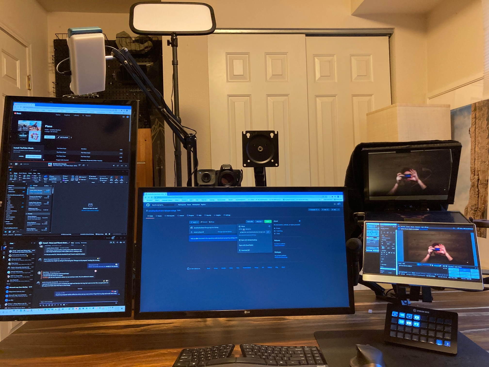

# Stream Setup

## Equipment
| Computer |
| :-- |
| [AMD Ryzen 9 3900X 12-Core Processor 3.80 GHz (OC 4.2GHz)](https://www.amd.com/en/products/cpu/amd-ryzen-9-3900x) |
| [AMD Radeon RX 5700 XT](https://www.amd.com/en/products/graphics/amd-radeon-rx-5700-xt) |
| [970 EVO Plus NVMe® M.2 SSD 1TB](https://www.samsung.com/us/computing/memory-storage/solid-state-drives/ssd-970-evo-plus-nvme-m-2-1-tb-mz-v7s1t0b-am/)|
| [Corsair Vengeance RGB Pro 64 GB (2 x 32 GB) DDR4-3600](https://www.corsair.com/us/en/Categories/Products/Memory/Vengeance-PRO-RGB-Black/p/CMW64GX4M2D3000C16) |
| [LG 27.0" 3840x2160 60 Hz Monitor](https://www.lg.com/us/monitors/lg-27UD58-B-4k-uhd-led-monitor?gclid=CjwKCAiAtdGNBhAmEiwAWxGcUo2IR5sVHlIPMTEPoXTwevUBt9UthLmgDUK_gfOmR8YDhyn1H70VRxoCILUQAvD_BwE&gclsrc=aw.ds) x 2 |
| [Elgato Cam Link Pro (Multi Camera Production)](https://www.elgato.com/en/cam-link-pro) |
| Full Build at [PC Part Picker](https://pcpartpicker.com/list/rcCzmk) |
| |
| **Desk** |
| [UPLIFT Standing Desk (V2) 72 x 30 - Pheasant Wood](https://www.upliftdesk.com/uplift-v2-standing-desk-v2-or-v2-commercial/)|
| [UPLIFT Range Dual Monitor](https://www.upliftdesk.com/range-dual-monitor-arm-uplift-desk/)|
| [UPLIFT Range Single Monitor Arm](https://www.upliftdesk.com/range-single-monitor-arm-uplift-desk/)
| [Webcam Mount 1/4" Desk Mount Camera Arm]() x 3 |
| | 
| **Cameras** |
|[Sony A6100 APS-C camera](https://www.sony.com/tz/electronics/interchangeable-lens-cameras/ilce-6100)|
|[Canon EOS M50](https://www.usa.canon.com/internet/portal/us/home/products/details/cameras/support-dslr/eos-50d/eos-50d) 
|[Logitech Streamcam](https://www.logitech.com/en-us/products/webcams/streamcam.960-001289.html?irclickid=2h%3AX6t2QjxyITbvyo0WQI33oUkBSogwlRRdGx00&utm_source=radius&utm_medium=affiliate&irgwc=1)|

| Lenses |
| :-- |
| [Canon EF-M 11-22mm f/4-5.6](https://www.usa.canon.com/internet/portal/us/home/products/details/lenses/ef/wide-angle/ef-m-11-22mm-f-4-5-6-is-stm/ef-m-11-22mm-f4-5-6-is-stm)|
| [Canon EF-M 32mm f/1.4](https://www.usa.canon.com/internet/portal/us/home/products/details/lenses/ef/standard-medium-telephoto/ef-m-32mm-f-1-4-stm) - In use |
|  Kit lense [Canon EF-M 15-45mm f/3.5-6.3](https://www.usa.canon.com/internet/portal/us/home/products/details/lenses/ef/standard-zoom/ef-m-15-45mm-is-stm) |
| Kit lense [E PZ 16–50 mm F3.5–5.6 OSS](https://electronics.sony.com/imaging/lenses/aps-c-e-mount/p/selp1650) - In use |

| Audio |
| :-- |
| [Scarlet Focusrite](https://focusrite.com/en/audio-interface/scarlett/scarlett-solo) |
|[Audio-Technica AT875R Line/Gradient Shotgun Condenser Microphone](https://www.audio-technica.com/en-gb/at875r)|
| [Bose SoundLink® wireless headphones II](https://www.bose.com/en_us/products/headphones/over_ear_headphones/soundlink-around-ear-wireless-headphones-ii.html#v=soundlink_ae_headphones_ii_black) | 

| Lighting |
| :-- |
| [Elgato Key Light](https://www.elgato.com/en/key-light)|
| [FalconEyes F7 Pocketlite](https://www.falconeyeshk.com/product-page/pockelite-f7) x 3 |
| [Bestshoot Desktop Mini Tripod]() x 2|

| Telemprompter|
| :-- |
| [Portable telemprompter]() |
| [Cutting Board]() |
| [Cooper 12.5in monitor](https://www.cocopar.net/details?product_id=59) x 2 |
| [MD-HX (HDMI / SDI Cross Converter)](https://decimator.com/Products/MiniConverters/MD-HX/MD-HX.html)|
| [Elgato M60 S](https://www.elgato.com/en/game-capture-hd60-s) |

| Controls |
| :-- |
| [Elgato Stream Deck XL](https://www.elgato.com/en/stream-deck-xl) |

| Software |
| :-- |
| [Xsplit Broadcaster](https://www.xsplit.com/broadcaster) |